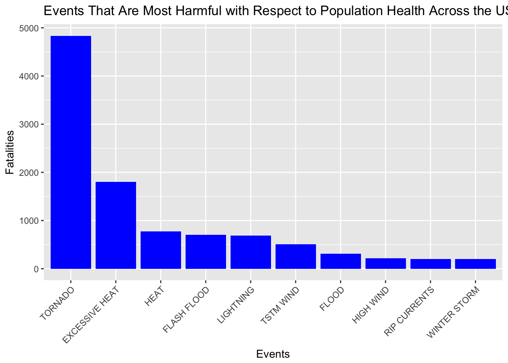
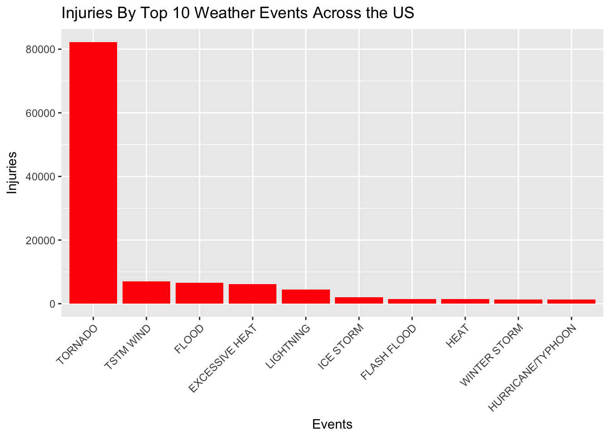
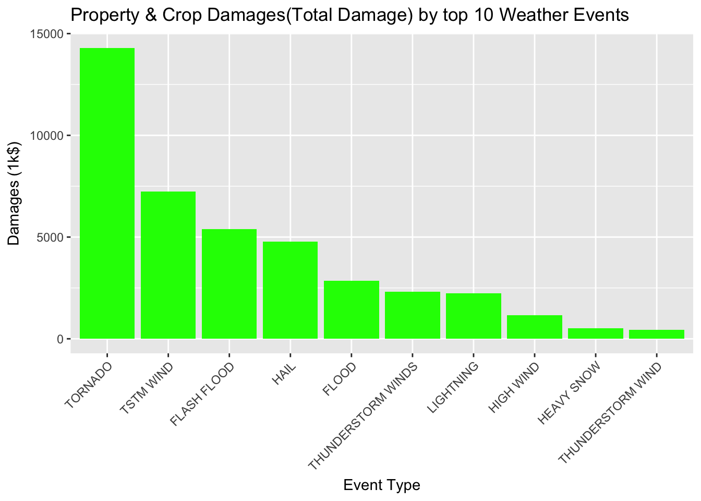

# Synopsis
Storms and other severe weather events can cause both public health and economic problems for communities and municipalities. Many severe events can result in fatalities, injuries, and property damage, and preventing such outcomes to the extent possible is a key concern.

This project involves exploring the U.S. National Oceanic and Atmospheric Administration's (NOAA) storm database. This database tracks characteristics of major storms and weather events in the United States, including when and where they occur, as well as estimates of any fatalities, injuries, and property damage.

This project explores 2 questions:
1. The types of events that are most harmful with respect to population health. 
2. The types of events that have the greatest economics consequences.

```{r setup, include=FALSE}
knitr::opts_chunk$set(echo = TRUE)
```


# Data Processing

Download data and read in as csv. Next we subset the data to grab the key elements that has economics consequences and health implications.
```{r Download Data}
download.file('https://d396qusza40orc.cloudfront.net/repdata%2Fdata%2FStormData.csv.bz2', destfile = 'Storm.csv.bz2', method = 'curl')
Storm = read.csv('Storm.csv.bz2',header = TRUE, sep = ",")

#review storm data
names(Storm)
#subset data
SubStorm = Storm[, c('EVTYPE','FATALITIES','INJURIES','PROPDMG','PROPDMGEXP','CROPDMG','CROPDMGEXP')]

```

Next step is to convert the values under variables by mapping the values
```{r}
library(plyr)
table(SubStorm$PROPDMGEXP)
tmpPROP=mapvalues(SubStorm$PROPDMGEXP, c("-","?","+", "0","1","2","3","4","5","6","7","8","B","h","H","K","m","M"," "),
          c(1,1, 1, 1,10, 10^2, 10^3,10^4,10^5,10^6,10^7,10^8,10^9, 10^2,10^2,10^3,10^6, 10^6,1))
table(SubStorm$CROPDMGEXP)
tmpCROP=mapvalues(SubStorm$CROPDMGEXP, c("?", "0","2","B","k","K","m","M"," "),
          c(1,1, 10^2, 10^9,10^3,10^3,10^6,10^6,1))

SubStorm$Tot_PropDMG = as.numeric(tmpPROP)*SubStorm$PROPDMG
SubStorm$Tot_CropDMG = as.numeric(tmpCROP)*SubStorm$CROPDMG

```

# Results

##Across the United States, which types of events (as indicated in the EVTYPE variable) are most harmful with respect to population health ?

```{r}
library(ggplot2)
event = aggregate(FATALITIES ~ EVTYPE, SubStorm, sum)
str(event)
#get top 10 
event = event[order(event$FATALITIES, decreasing = T),][1:10,]

#factor the events to get descending order for graph
event$EVTYPE <- factor(event$EVTYPE, levels = event$EVTYPE)

ggplot(event, aes(x=EVTYPE, y= FATALITIES)) +
  geom_bar(stat = 'identity', fill = 'blue')+
  theme(axis.text.x = element_text(angle = 45, hjust = 1)) + 
  xlab('Events')+
  ylab('Fatalities')+
  ggtitle('Events That Are Most Harmful with Respect to Population Health Across the US')
  
```
 

Number of Injuries BY TOP 10 Wrather Events
```{r}
Injuries = aggregate(INJURIES ~ EVTYPE, SubStorm, sum)
str(Injuries)
#get top 10 
Injuries = Injuries[order(Injuries$INJURIES, decreasing = T),][1:10,]

#factor the events to get descending order for graph
Injuries$EVTYPE <- factor(Injuries$EVTYPE, levels = Injuries$EVTYPE)

ggplot(Injuries, aes(x=EVTYPE, y= INJURIES)) +
  geom_bar(stat = 'identity', fill = 'red')+
  theme(axis.text.x = element_text(angle = 45, hjust = 1)) + 
  xlab('Events')+
  ylab('Injuries')+
  ggtitle('Injuries By Top 10 Weather Events Across the US')

```
 
## Across the United States, which types of events have the greatest economic consequences ?

```{r}
SubStorm$TotalDamage = SubStorm$Tot_CropDMG +SubStorm$Tot_PropDMG

DMG = aggregate(TotalDamage ~ EVTYPE, data=SubStorm, sum)
str(DMG)
DMG = DMG[order(DMG$TotalDamage, decreasing = T), ][1:10, ]
DMG$EVTYPE = factor(DMG$EVTYPE, levels = DMG$EVTYPE)

ggplot(DMG, aes(x = EVTYPE, y = TotalDamage/10^3)) + 
    geom_bar(stat = "identity", fill = "green") + 
    theme(axis.text.x = element_text(angle = 45, hjust = 1)) + 
    xlab("Event Type") + ylab("Damages (1k$)") + ggtitle("Property & Crop Damages(Total Damage) by top 10 Weather Events")

```
 


Conclusion: It appears that Tornado causes not only the most damage to human health but the economics damages as well.
